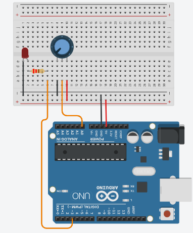

# Arduino Analog Control Potentiometer

This project demonstrates the design and implementation of analog input system using an Arduino. a potentiometer acts as an analog sensor to control the brightness of another LED. The system is built on a breadboard and programmed using Arduino IDE, making it suitable for beginners learning embedded systems and basic electronics.



## Project Overview
The project consists a potentiometer adjusts the brightness of another LED using PWM.

---

## Components Used
- Arduino Uno
- Breadboard
- Potentiometer (Analog Sensor)
- LED
- 220Ω Resistor (for LED)
- Jumper Wires

---

## Circuit Configuration
- Middle pin connected to A0
- Side pins connected to 5V & GND
- LED connected to Pin 3 (PWM) with 220Ω resistor

## Wiring Summary  
5V → one side  
GND → other side  
Middle → A0  

Pin 3 → 220Ω → LED → GND  

---

## Arduino Code

```cpp
int potPin = A0;
int ledPin = 3;


void setup() {
  pinMode(ledPin, OUTPUT);
}

void loop() {
    
  int value = analogRead(potPin);   
  int brightness = map(value, 0, 1023, 0, 255);

  analogWrite(ledPin, brightness); 
}


```

